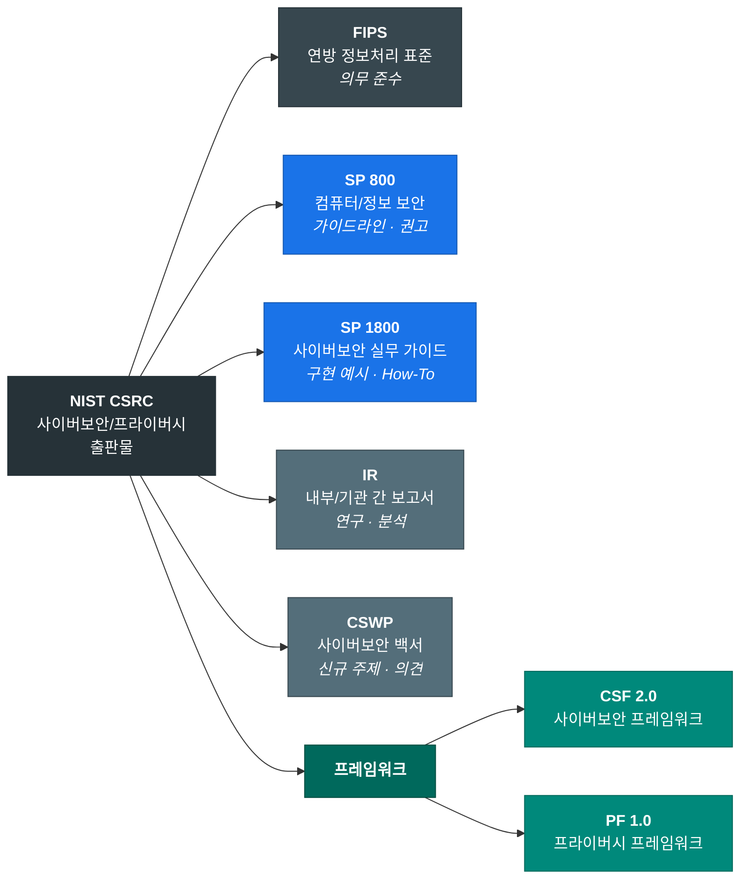
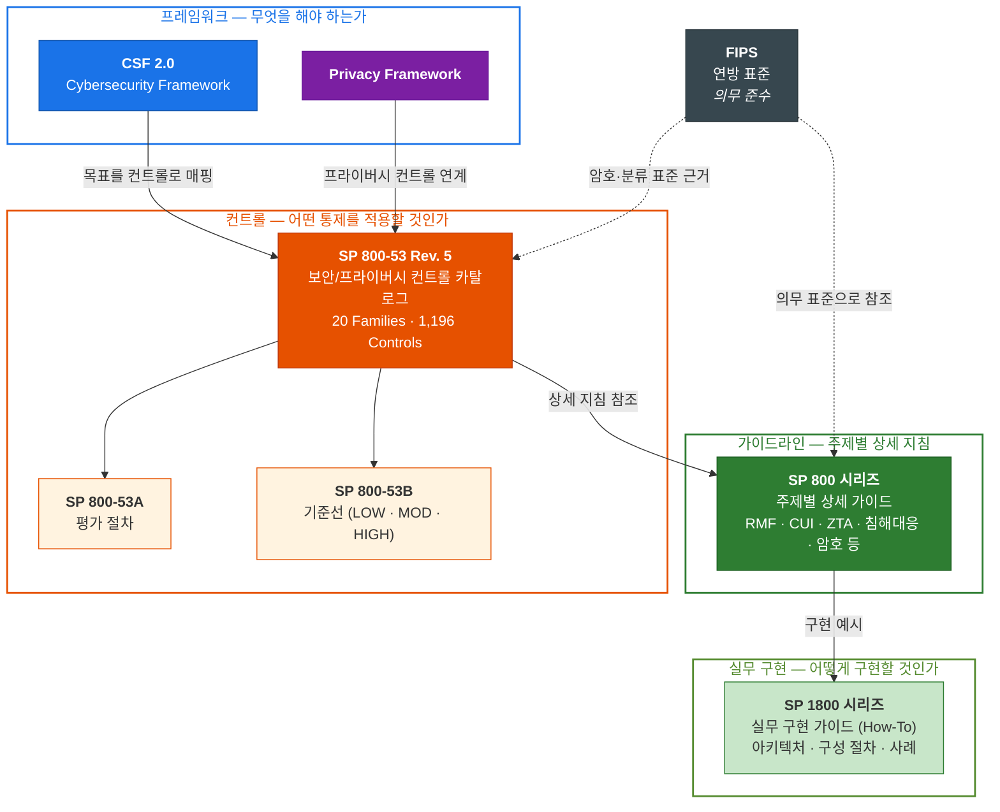

# NIST 사이버보안 및 프라이버시 문서 체계

## 개요

NIST(National Institute of Standards and Technology, 미국 국립표준기술연구소)는 미국 연방 정보보안 현대화법(FISMA)에 따라 정보보안 표준 및 가이드라인을 개발하는 기관입니다. NIST의 사이버보안/프라이버시 관련 출판물은 미국 연방기관을 대상으로 하지만, 그 체계성과 공신력 때문에 전 세계 보안 실무의 사실상 표준(de facto standard)으로 널리 참조됩니다.

> NIST의 모든 출판물은 미국 정부 저작물(U.S. Government Work)로서 **퍼블릭 도메인**이며, 자유롭게 활용할 수 있습니다.

---

## 시리즈 구조

NIST 사이버보안/프라이버시 출판물은 **CSRC**(Computer Security Resource Center)를 통해 관리되며, 아래 시리즈로 분류됩니다.



### 시리즈 간 관계

아래 다이어그램은 위에서 아래로 **추상화 수준이 낮아지는** 구조입니다. 상위 계층이 "무엇을" 정의하면, 하위 계층이 "어떻게"를 구체화합니다.



---

## 상세 안내

### 한눈에 보기

아래 표는 위 다이어그램의 위계 순서(프레임워크 → 컨트롤 → 가이드라인 → 실무 구현 → 표준 → 기타)로 정렬되어 있습니다.

| 시리즈 | 성격 | 문서 수 | 핵심 키워드 | 링크 |
|--------|------|---------|------------|------|
| **CSF 2.0** | 사이버보안 프레임워크 | — | 6 Functions, 22 Categories, 106 Subcategories | [CSF](https://www.nist.gov/cyberframework) |
| **PF 1.0** | 프라이버시 프레임워크 | — | 5 Functions | [PF](https://www.nist.gov/privacy-framework) |
| **SP 800-53** | 보안/프라이버시 컨트롤 | 1,196 컨트롤 | 20 Families, 4 Baselines | [SP 800-53](https://csrc.nist.gov/pubs/sp/800/53/r5/upd1/final) |
| **SP 800** | 가이드라인 (권고) | 220건+ | 컨트롤, RMF, ZTA, 침해대응, 암호 | [SP 800](https://csrc.nist.gov/publications/sp800) |
| **SP 1800** | 실무 구현 사례 | 41건 | 랜섬웨어, ZTA 구현, IoT, PQC | [SP 1800](https://csrc.nist.gov/publications/sp1800) |
| **FIPS** | 연방 표준 (의무) | 12건 | AES, SHA, 암호모듈, 보안분류 | [FIPS](https://csrc.nist.gov/publications/fips) |
| **IR** | 연구/분석 보고서 | 326건+ | ERM, IoT, 신기술 분석 | [IR](https://csrc.nist.gov/publications/ir) |
| **CSWP** | 백서 | 55건 | 신규 주제, CSF/PF 원문 | [CSWP](https://csrc.nist.gov/publications/white-papers) |

> 아래 각 항목을 클릭하면 상세 내용을 확인할 수 있습니다.

---

### 프레임워크 — 무엇을 해야 하는가

<details>
<summary><b>Cybersecurity Framework (CSF) 2.0</b></summary>

| 항목 | 내용 |
|------|------|
| **발행일** | 2024년 2월 26일 |
| **이전 버전** | CSF 1.1 (2018년) |
| **URL** | https://www.nist.gov/cyberframework |

CSF는 NIST의 다양한 문서를 **하나의 체계**로 엮는 최상위 프레임워크입니다.

**구조: 6 Functions → Categories → Subcategories**

| Function | 코드 | 설명 | Categories |
|----------|------|------|-----------|
| **Govern** | GV | 조직의 사이버보안 리스크 관리 전략, 기대치, 정책을 수립하고 모니터링. **CSF 2.0에서 신설** | 6개 |
| **Identify** | ID | 현재의 사이버보안 리스크를 이해 — 자산, 취약점, 위협 식별 | 3개 |
| **Protect** | PR | 보안 위험을 관리하기 위한 보호조치 적용 — 접근제어, 교육, 데이터 보안 | 5개 |
| **Detect** | DE | 사이버보안 공격과 침해를 탐지 — 지속적 모니터링, 이상 분석 | 2개 |
| **Respond** | RS | 탐지된 사이버보안 사고에 대응 — 사고 관리, 분석, 완화, 보고 | 4개 |
| **Recover** | RC | 사이버보안 사고로 영향받은 자산과 운영을 복구 | 2개 |

> **총 22 Categories, 106 Subcategories**

```
CSF 2.0 계층 구조 예시:

GV (Govern)
├── GV.OC (Organizational Context)
│   ├── GV.OC-01: 조직의 미션이 이해되고 사이버보안 리스크 관리에 반영
│   ├── GV.OC-02: 내부/외부 이해관계자가 파악되고 그들의 요구사항이 이해됨
│   └── ...
├── GV.RM (Risk Management Strategy)
│   ├── GV.RM-01: 리스크 관리 목표가 수립되고 이해관계자의 동의를 받음
│   └── ...
├── GV.RR (Roles, Responsibilities, and Authorities)
├── GV.PO (Policy)
├── GV.OV (Oversight)
└── GV.SC (Cybersecurity Supply Chain Risk Management)
```

**CSF의 활용 방식**

1. **Current Profile**: 현재 사이버보안 상태를 CSF 항목으로 매핑
2. **Target Profile**: 목표 사이버보안 상태를 정의
3. **Gap Analysis**: Current vs Target 비교 → 우선순위 도출
4. **Implementation Tiers** (Tier 1~4): 조직의 리스크 관리 성숙도 수준

</details>

<details>
<summary><b>Privacy Framework (PF) 1.0</b></summary>

| 항목 | 내용 |
|------|------|
| **발행일** | 2020년 1월 16일 |
| **차기 버전** | PF 1.1 (Initial Public Draft 공개, 최종판 발행 예정) |
| **URL** | https://www.nist.gov/privacy-framework |

CSF와 유사한 구조로, 프라이버시 리스크 관리를 위한 프레임워크입니다.

**구조: 5 Functions**

| Function | 설명 |
|----------|------|
| **Identify-P** | 프라이버시 리스크 관리를 위한 조직적 이해 |
| **Govern-P** | 프라이버시 거버넌스 체계 |
| **Control-P** | 데이터 처리에 대한 관리 활동 |
| **Communicate-P** | 데이터 처리 관행에 대한 이해관계자 소통 |
| **Protect-P** | 데이터 보호를 위한 기술적/관리적 조치 |

</details>

---

### 컨트롤 — 어떤 통제를 적용할 것인가

<details>
<summary><b>SP 800-53 Rev. 5: 보안 컨트롤 체계</b></summary>

SP 800-53은 NIST 체계에서 가장 핵심적인 문서입니다. CSF의 추상적 목표를 구체적인 **보안 컨트롤**로 변환합니다. 53 시리즈는 3개 문서로 구성됩니다:

| 문서 | 역할 | 핵심 질문 |
|------|------|----------|
| **SP 800-53** | 컨트롤 카탈로그 | "어떤 통제 항목이 존재하는가?" — 20개 패밀리, 1,196 컨트롤 정의 |
| **SP 800-53A** | 평가 절차 | "컨트롤이 제대로 구현되었는지 어떻게 검증하는가?" — 각 컨트롤별 평가 방법과 판단 기준 |
| **SP 800-53B** | 기준선 | "우리 시스템에 어떤 컨트롤을 적용해야 하는가?" — 영향도별(LOW/MOD/HIGH) 필수 컨트롤 세트 |

**20개 컨트롤 패밀리**

| 코드 | 패밀리 | 설명 |
|------|--------|------|
| AC | Access Control | 접근 제어 정책 및 메커니즘 |
| AT | Awareness and Training | 보안 교육 및 인식 |
| AU | Audit and Accountability | 감사 로깅, 검토, 보존 |
| CA | Assessment, Authorization, and Monitoring | 보안 평가 및 인가 |
| CM | Configuration Management | 구성 기준선 및 변경 통제 |
| CP | Contingency Planning | 사업 연속성 및 재해 복구 |
| IA | Identification and Authentication | 신원 확인 메커니즘 |
| IR | Incident Response | 사고 탐지, 처리, 보고 |
| MA | Maintenance | 시스템 유지보수 |
| MP | Media Protection | 매체 접근, 표시, 저장, 폐기 |
| PE | Physical and Environmental Protection | 물리적 접근 및 환경 통제 |
| PL | Planning | 보안 계획 및 시스템 보안 계획서 |
| PM | Program Management | 조직 차원의 정보보안 프로그램 |
| PS | Personnel Security | 인력 심사 및 접근 계약 |
| PT | PII Processing and Transparency | 개인정보 처리 및 투명성 |
| RA | Risk Assessment | 위험 식별, 분석, 대응 |
| SA | System and Services Acquisition | 안전한 개발 및 공급망 |
| SC | System and Communications Protection | 암호화 및 통신 보호 |
| SI | System and Information Integrity | 결함 교정, 모니터링, 악성코드 보호 |
| SR | Supply Chain Risk Management | 공급망 통제 및 출처 |

**기준선 (Baselines)**

SP 800-53B에서 정의하는 기준선은 시스템의 영향도(Impact Level)에 따라 적용할 컨트롤 세트를 지정합니다.

| 기준선 | 영향도 | 대략적 컨트롤 수 | 적용 상황 |
|--------|--------|----------------|----------|
| LOW | 제한적 피해 | ~155개 | 기밀성/무결성/가용성 손실 시 피해가 제한적 |
| MODERATE | 심각한 피해 | ~325개 | 피해가 심각한 수준 |
| HIGH | 치명적 피해 | ~380개 | 피해가 치명적/재앙적 |
| PRIVACY | 개인정보 | ~110개 | PII를 처리하는 시스템 |

</details>

---

### 가이드라인 — 주제별 상세 지침

<details>
<summary><b>SP 800 시리즈 — 가이드라인 및 권고사항 (220건+)</b></summary>

NIST 사이버보안의 핵심 시리즈입니다. 번호는 800-12부터 800-236까지 있으며, 주요 문서를 주제별로 분류하면:

**위험 관리 (Risk Management)**

| 문서 | 제목 | 핵심 내용 |
|------|------|----------|
| SP 800-30 | Guide for Conducting Risk Assessments | 위험 평가 수행 가이드 |
| SP 800-37 | Risk Management Framework (RMF) | **위험관리 프레임워크** — 분류→선택→구현→평가→인가→모니터링 6단계 |
| SP 800-39 | Managing Information Security Risk | 조직 수준의 정보보안 위험 관리 |

**보안 컨트롤 (Security Controls)**

| 문서 | 제목 | 핵심 내용 |
|------|------|----------|
| SP 800-53 Rev. 5 | Security and Privacy Controls | **보안/프라이버시 컨트롤 카탈로그.** 20개 패밀리, 1,196 컨트롤. NIST 체계의 핵심 |
| SP 800-53A | Assessing Security and Privacy Controls | 컨트롤 평가 절차 |
| SP 800-53B | Control Baselines | 영향도(LOW/MODERATE/HIGH)별 기준선 |

**CUI 보호 (Controlled Unclassified Information)**

| 문서 | 제목 | 핵심 내용 |
|------|------|----------|
| SP 800-171 Rev. 3 | Protecting CUI in Nonfederal Systems | 비연방 시스템의 CUI 보호 요구사항. **CMMC 2.0의 기반** |
| SP 800-172 | Enhanced Security Requirements for CUI | CUI 보호 강화 요구사항 |

**인증 및 접근 제어 (Identity & Access)**

| 문서 | 제목 | 핵심 내용 |
|------|------|----------|
| SP 800-63-4 | Digital Identity Guidelines | 디지털 인증 가이드라인 (IAL/AAL/FAL) |
| SP 800-207 | Zero Trust Architecture | **제로 트러스트 아키텍처** 참조 모델 |

**침해사고 대응 (Incident Response)**

| 문서 | 제목 | 핵심 내용 |
|------|------|----------|
| SP 800-61 Rev. 3 | Incident Response Recommendations | 침해사고 대응 권고사항 (CSF 2.0 연계) |
| SP 800-86 | Guide to Integrating Forensic Techniques | 포렌식 기법 가이드 |
| SP 800-83 | Guide to Malware Incident Prevention | 악성코드 사고 예방/대응 |

**보안 테스트 및 평가 (Testing & Assessment)**

| 문서 | 제목 | 핵심 내용 |
|------|------|----------|
| SP 800-115 | Technical Guide to Information Security Testing | 보안 테스트 기술 가이드 |
| SP 800-137 | Information Security Continuous Monitoring | 지속적 모니터링 |

**클라우드 및 신기술 (Cloud & Emerging Tech)**

| 문서 | 제목 | 핵심 내용 |
|------|------|----------|
| SP 800-210 | General Access Control Guidance for Cloud Systems | 클라우드 접근 제어 |
| SP 800-213 | IoT Device Cybersecurity Guidance | IoT 디바이스 보안 |
| SP 800-218 | Secure Software Development Framework (SSDF) | 안전한 소프트웨어 개발 프레임워크 |
| SP 800-228 | Guidance for Securing AI Systems | AI 시스템 보안 가이드 |

**암호 (Cryptography)**

| 문서 | 제목 | 핵심 내용 |
|------|------|----------|
| SP 800-57 | Recommendation for Key Management | 키 관리 권고사항 (Part 1~3) |
| SP 800-175B | Guideline for Using Cryptographic Standards | 암호 표준 사용 가이드 |
| SP 800-227 | Recommendations for Key-Encapsulation Mechanisms | 양자내성 암호 키 캡슐화 권고 |

**OT/산업제어 (Operational Technology)**

| 문서 | 제목 | 핵심 내용 |
|------|------|----------|
| SP 800-82 Rev. 3 | Guide to Operational Technology (OT) Security | OT/ICS/SCADA 보안 가이드 |

> 위 목록은 SP 800 시리즈의 **주요 문서**만 발췌한 것입니다. 전체 목록은 [NIST SP 800 시리즈 페이지](https://csrc.nist.gov/publications/sp800)에서 확인할 수 있습니다.

</details>

---

### 실무 구현 — 어떻게 구현할 것인가

<details>
<summary><b>SP 1800 시리즈 — 실무 구현 가이드 (41건)</b></summary>

NCCoE(National Cybersecurity Center of Excellence)에서 발행합니다. SP 800이 "무엇을, 왜"를 설명한다면, SP 1800은 **"실제로 어떻게 구현하는가"** 를 보여줍니다.

각 문서는 보통 3개 파트로 구성됩니다:
- **Volume A**: Executive Summary (경영진 요약)
- **Volume B**: Approach, Architecture, and Security Characteristics (접근 방법)
- **Volume C**: How-To Guides (단계별 구현 절차)

| 문서 | 주제 |
|------|------|
| SP 1800-25 | Data Integrity: Identifying and Protecting Assets Against Ransomware |
| SP 1800-26 | Data Integrity: Detecting and Responding to Ransomware |
| SP 1800-35 | Implementing a Zero Trust Architecture |
| SP 1800-36 | Trusted IoT Onboarding |
| SP 1800-38 | Migration to Post-Quantum Cryptography |

</details>

---

### 연방 표준 및 기타

<details>
<summary><b>FIPS — 연방 정보처리 표준 (12건)</b></summary>

연방 표준으로, 미국 연방기관은 **의무 준수** 대상입니다. FISMA에 의해 NIST에 표준 개발 권한이 부여되었습니다.

> **FIPS와 SP의 차이:** FIPS는 "무엇을 해야 하는가"(의무), SP는 "어떻게 해야 하는가"(권고). 예: FIPS 200이 최소 보안 요구사항을 정의하면, SP 800-53이 그 요구사항을 충족하기 위한 구체적 보안 컨트롤을 제공합니다.

| 번호 | 제목 | 내용 |
|------|------|------|
| FIPS 140-3 | Security Requirements for Cryptographic Modules | 암호 모듈 보안 요구사항. 모든 연방 암호 모듈이 준수해야 하는 표준 |
| FIPS 180-4 | Secure Hash Standard (SHS) | SHA-1, SHA-224, SHA-256, SHA-384, SHA-512 해시 함수 표준 |
| FIPS 186-5 | Digital Signature Standard (DSS) | 디지털 서명 알고리즘 표준 (RSA, ECDSA, EdDSA) |
| FIPS 197 | Advanced Encryption Standard (AES) | AES 암호화 알고리즘 표준 |
| FIPS 198-1 | The Keyed-Hash Message Authentication Code (HMAC) | HMAC 표준 |
| FIPS 199 | Standards for Security Categorization | 정보/정보시스템의 보안 분류 기준 (LOW/MODERATE/HIGH) |
| FIPS 200 | Minimum Security Requirements | 연방 정보시스템 최소 보안 요구사항 |
| FIPS 201-3 | Personal Identity Verification (PIV) | 연방 직원/계약자 신원확인 표준 |
| FIPS 202 | SHA-3 Standard | SHA-3 해시 함수 표준 |
| FIPS 203 | ML-KEM (Module-Lattice-Based Key-Encapsulation) | 양자내성 키 캡슐화 표준 |
| FIPS 204 | ML-DSA (Module-Lattice-Based Digital Signature) | 양자내성 디지털 서명 표준 |
| FIPS 205 | SLH-DSA (Stateless Hash-Based Digital Signature) | 양자내성 해시 기반 서명 표준 |

</details>

<details>
<summary><b>NIST IR — 연구/분석 보고서 (326건+)</b></summary>

특정 주제에 대한 연구 결과나 심층 분석을 담습니다. 일부는 이후 SP 시리즈로 발전하기도 합니다.

| 문서 | 제목 |
|------|------|
| IR 8286 | Integrating Cybersecurity and Enterprise Risk Management (ERM) |
| IR 8259 | Foundational Cybersecurity Activities for IoT Device Manufacturers |
| IR 8401 | Satellite Ground Segment: Applying the CSF to Satellite C2 |

</details>

<details>
<summary><b>CSWP — 사이버보안 백서 (55건)</b></summary>

신규 주제에 대한 의견 제시나 프레임워크 문서를 포함합니다.

> CSF 2.0과 Privacy Framework도 CSWP로 분류됩니다.  
> 예: CSWP 29 = CSF 2.0, CSWP 10 = Privacy Framework 1.0

</details>

---

## 부록

<details>
<summary><b>문서 상태(Publication Status)</b></summary>

| 상태 | 의미 |
|------|------|
| **Final** | 최종 확정본 |
| **Public Draft** / **IPD** | 공개 초안 — 공개 의견 수렴 중 |
| **Withdrawn** | 폐지 — 더 이상 유효하지 않음 |

NIST 문서는 지속적으로 개정되며, 개정 시 `Rev. N` (Revision)이 붙습니다.  
예: SP 800-53 Rev. 5, SP 800-171 Rev. 3

</details>

<details>
<summary><b>머신 리더블 데이터(Machine-Readable Data)</b></summary>

NIST는 문서 내용을 프로그래밍 방식으로 접근할 수 있도록 여러 형식을 제공합니다.

| 도구/형식 | 설명 | URL |
|-----------|------|-----|
| **OSCAL** | Open Security Controls Assessment Language (v1.0.6). SP 800-53 컨트롤을 JSON/XML/YAML로 제공 | https://pages.nist.gov/OSCAL/ |
| **CPRT** | Cybersecurity and Privacy Reference Tool. 컨트롤 간 관계를 JSON/XLSX로 제공 | https://csrc.nist.gov/projects/cprt |
| **NVD API** | National Vulnerability Database API. CVE/CPE 데이터를 REST API로 제공 | https://nvd.nist.gov/developers |
| **Publications XLSX** | 전체 출판물 메타데이터를 엑셀로 다운로드 | [다운로드](https://csrc.nist.gov/files/pubs/shared/docs/NIST-Cybersecurity-Publications.xlsx) |
| **RSS/JSON Feed** | 공개 초안 알림 피드 | https://csrc.nist.gov/CSRC/media/feeds/pubs/drafts-open-for-comment.json |
| **GitHub** | OSCAL 콘텐츠, 기술 출판물 메타데이터 등 | https://github.com/usnistgov |

</details>

<details>
<summary><b>참고 링크</b></summary>

| 리소스 | URL |
|--------|-----|
| NIST CSRC (메인) | https://csrc.nist.gov |
| SP 800 시리즈 | https://csrc.nist.gov/publications/sp800 |
| SP 1800 시리즈 | https://csrc.nist.gov/publications/sp1800 |
| NIST IR 시리즈 | https://csrc.nist.gov/publications/ir |
| FIPS | https://csrc.nist.gov/publications/fips |
| CSF 2.0 | https://www.nist.gov/cyberframework |
| Privacy Framework | https://www.nist.gov/privacy-framework |
| NVD | https://nvd.nist.gov |
| OSCAL | https://pages.nist.gov/OSCAL |
| CPRT | https://csrc.nist.gov/projects/cprt |

</details>
