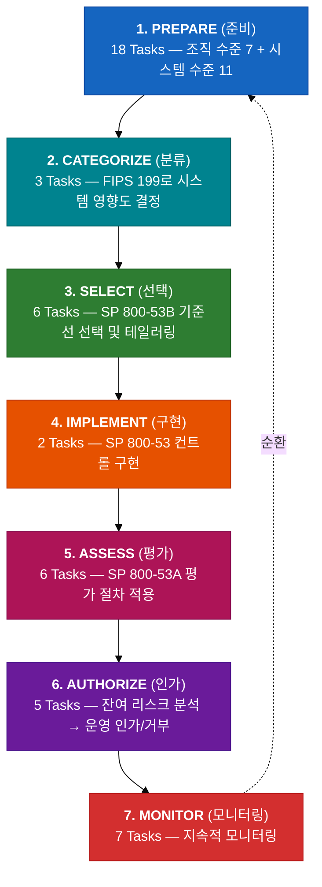

# SP 800-37 Rev. 2: 위험관리 프레임워크 (RMF)

## 개요

| 항목 | 내용 |
|------|------|
| **정식 명칭** | Risk Management Framework for Information Systems and Organizations: A System Life Cycle Approach for Security and Privacy |
| **문서 번호** | SP 800-37 Revision 2 |
| **발행일** | 2018년 12월 |
| **대상** | 연방 정보시스템 및 조직 (민간 부문에서도 널리 참조) |
| **원문** | https://csrc.nist.gov/pubs/sp/800/37/r2/final |

RMF(Risk Management Framework)는 NIST 사이버보안 체계 전체를 **운영하는 프로세스**입니다. CSF가 "무엇을" 정의하고 SP 800-53이 "어떤 컨트롤을" 제공한다면, RMF는 이것들을 **언제, 누가, 어떤 순서로** 실행하는지를 정의합니다.

---

## Rev. 2의 주요 변경점 (vs Rev. 1)

| 변경 사항 | 설명 |
|-----------|------|
| **Prepare 단계 신설** | 기존 6단계 → 7단계. 조직/시스템 수준의 준비 활동 18개 Task 추가 |
| **프라이버시 통합** | 모든 단계에 프라이버시 고려사항 통합 |
| **공급망 리스크 관리** | 전 단계에 SCRM(Supply Chain Risk Management) 통합 |
| **지속적 모니터링 강화** | 각 단계에서 지속적 모니터링 전략 포함 |
| **CSF 연계** | Cybersecurity Framework와의 매핑 명시 |

---

## RMF와 다른 NIST 문서의 관계

RMF의 각 단계는 특정 NIST 문서를 참조합니다:

| RMF 단계 | 참조 문서 | 역할 |
|----------|----------|------|
| **Prepare** | SP 800-39, SP 800-30 | 리스크 관리 전략 수립, 리스크 평가 |
| **Categorize** | **FIPS 199**, FIPS 200 | 시스템 영향도 분류 (LOW/MOD/HIGH) |
| **Select** | **SP 800-53B** | 기준선 선택 및 테일러링 |
| **Implement** | **SP 800-53**, SP 800 시리즈 | 컨트롤 구현, 주제별 상세 지침 참조 |
| **Assess** | **SP 800-53A** | 컨트롤 평가 절차 |
| **Authorize** | SP 800-30 | 잔여 리스크 분석 및 인가 결정 |
| **Monitor** | SP 800-137 | 지속적 모니터링 |

---

## 수치 요약

| 구분 | 수량 |
|------|------|
| RMF 단계 | 7개 |
| 총 Task | 47개 |
| — Prepare (조직 수준) | 7개 |
| — Prepare (시스템 수준) | 11개 |
| — Categorize | 3개 |
| — Select | 6개 |
| — Implement | 2개 |
| — Assess | 6개 |
| — Authorize | 5개 |
| — Monitor | 7개 |

---

## 핵심 역할

RMF는 각 Task마다 **주요 책임 역할**을 지정합니다.

| 역할 | 설명 |
|------|------|
| **Authorizing Official (AO)** | 시스템 운영을 인가/거부하는 최종 권한자 |
| **System Owner** | 시스템의 전반적 책임자 — 대부분의 Task에서 주요 역할 |
| **System Security Officer (SSO)** | 시스템 보안의 실무 책임자 |
| **Chief Information Officer (CIO)** | 조직의 정보기술 및 보안 전략 총괄 |
| **Senior Agency Information Security Officer (SAISO)** | 조직 수준 정보보안 담당 |
| **Senior Agency Official for Privacy (SAOP)** | 조직의 프라이버시 프로그램 총괄 — Rev. 2에서 강화된 프라이버시 통합의 핵심 역할 |
| **Risk Executive** | 조직의 리스크 관리 전략 및 허용수준 결정 |
| **Control Assessor** | 컨트롤 평가 수행 (독립성 요구) |
| **Information Owner/Steward** | 정보 유형 및 생명주기 관리 |

---

## RMF 7단계 전체 구조

### 한눈에 보기

> 아래 각 단계를 클릭하면 Task 전체 목록을 확인할 수 있습니다.

---

<b>Step 1: PREPARE (준비) — 18 Tasks</b>

RMF를 실행하기 위한 필수 준비 활동입니다. **Rev. 2에서 신설된 단계**이며, 조직 수준과 시스템 수준으로 나뉩니다.

**조직 수준 (Organization-Level) — 7 Tasks**

| Task | 명칭 | 설명 | 주요 역할 |
|------|------|------|----------|
| P-1 | Risk Management Roles | 보안/프라이버시 리스크 관리 역할을 식별하고 배정 | Head of Agency, CIO |
| P-2 | Risk Management Strategy | 리스크 허용수준을 포함한 조직의 리스크 관리 전략 수립 | Risk Executive |
| P-3 | Risk Assessment—Organization | 조직 수준의 리스크 평가 수행 또는 기존 평가 갱신 | SAISO |
| P-4 | Organizationally-Tailored Control Baselines and CSF Profiles *(선택)* | 조직에 맞춤화된 컨트롤 기준선 및 CSF 프로파일 수립 | CIO |
| P-5 | Common Control Identification | 조직 시스템이 상속할 수 있는 공통 컨트롤 식별·문서화·공개 | SAISO |
| P-6 | Impact-Level Prioritization *(선택)* | 동일 영향도의 시스템 간 우선순위 결정 | Risk Executive |
| P-7 | Continuous Monitoring Strategy—Organization | 조직 수준의 컨트롤 효과성 모니터링 전략 수립 | CIO |

**시스템 수준 (System-Level) — 11 Tasks**

| Task | 명칭 | 설명 | 주요 역할 |
|------|------|------|----------|
| P-8 | Mission or Business Focus | 시스템의 미션/비즈니스 목적과 동인 식별·문서화 | System Owner |
| P-9 | System Stakeholders | 시스템 이해관계자 식별·문서화 | System Owner |
| P-10 | Asset Identification | 시스템 구성 자산 식별·문서화 | System Owner |
| P-11 | Authorization Boundary | 시스템의 인가 경계 정의·문서화 | System Owner, AO |
| P-12 | Information Types | 시스템이 처리·저장·전송하는 정보 유형 식별·문서화 | Information Owner |
| P-13 | Information Life Cycle | 시스템의 정보 생명주기 식별·문서화 | Information Owner |
| P-14 | Risk Assessment—System | 시스템 수준 리스크 평가 수행 | System Owner |
| P-15 | Requirements Definition | 시스템의 보안/프라이버시 요구사항 정의·문서화 | System Owner, SSO |
| P-16 | Enterprise Architecture | 시스템이 엔터프라이즈 아키텍처와 일관되도록 보장 | CIO |
| P-17 | Requirements Allocation | 보안/프라이버시 요구사항을 시스템 요소에 할당 | System Owner |
| P-18 | System Registration | 시스템을 조직에 등록 | CIO |

<b>Step 2: CATEGORIZE (분류) — 3 Tasks</b>

시스템과 정보의 보안 범주를 결정합니다. **FIPS 199**에 따라 기밀성/무결성/가용성 각각의 영향도를 평가하고, 가장 높은 값이 시스템의 전체 영향도가 됩니다.

| Task | 명칭 | 설명 | 주요 역할 |
|------|------|------|----------|
| C-1 | System Description | 시스템의 특성을 기술·문서화 | System Owner |
| C-2 | Security Categorization | FIPS 199에 따라 시스템의 보안 범주를 결정 (LOW/MODERATE/HIGH) | System Owner, Information Owner |
| C-3 | Security Categorization Review and Approval | 보안 범주 결정 결과를 검토하고 승인 | AO, SAISO |

<b>Step 3: SELECT (선택) — 6 Tasks</b>

시스템의 리스크에 상응하는 컨트롤을 선택하고 조정합니다. **SP 800-53B**의 기준선을 기반으로 조직 상황에 맞게 테일러링합니다.

| Task | 명칭 | 설명 | 주요 역할 |
|------|------|------|----------|
| S-1 | Control Selection | 리스크에 상응하는 컨트롤 기준선 선택 | System Owner, SSO |
| S-2 | Control Tailoring | 선택된 기준선을 조직/시스템 상황에 맞게 조정 (테일러링) | System Owner, SSO |
| S-3 | Control Allocation | 컨트롤을 시스템 고유/하이브리드/공통으로 지정하고 시스템 요소에 할당 | System Owner, SSO |
| S-4 | Documentation of Planned Control Implementations | 컨트롤과 테일러링 조치를 보안/프라이버시 계획서에 문서화 | SSO |
| S-5 | Continuous Monitoring Strategy—System | 조직 리스크 관리 전략을 반영한 시스템 수준 지속적 모니터링 전략 수립 | System Owner, SSO |
| S-6 | Plan Review and Approval | 보안/프라이버시 계획서를 Authorizing Official이 검토·승인 | AO |

<b>Step 4: IMPLEMENT (구현) — 2 Tasks</b>

보안/프라이버시 계획서에 명시된 컨트롤을 실제로 구현합니다.

| Task | 명칭 | 설명 | 주요 역할 |
|------|------|------|----------|
| I-1 | Control Implementation | 보안/프라이버시 계획서에 명시된 컨트롤을 시스템 보안/프라이버시 엔지니어링 방법론으로 구현 | System Owner, System Developer |
| I-2 | Update Control Implementation Information | 구현 중 변경 사항을 문서화하고 보안/프라이버시 계획서 갱신 | System Owner, SSO |

<b>Step 5: ASSESS (평가) — 6 Tasks</b>

구현된 컨트롤이 올바르게 작동하고 원하는 성과를 달성하는지 평가합니다. **SP 800-53A**의 평가 절차를 적용합니다.

| Task | 명칭 | 설명 | 주요 역할 |
|------|------|------|----------|
| A-1 | Assessor Selection | 적절한 독립성을 갖춘 평가자/평가팀 선정 | AO, System Owner |
| A-2 | Assessment Plan | 평가에 필요한 문서를 준비하고 보안/프라이버시 평가 계획 수립·검토·승인 | Control Assessor |
| A-3 | Control Assessments | 평가 계획에 따라 컨트롤 평가 수행 | Control Assessor |
| A-4 | Assessment Reports | 발견 사항과 권고 사항을 포함한 보안/프라이버시 평가 보고서 완성 | Control Assessor |
| A-5 | Remediation Actions | 컨트롤 결함을 해결하기 위한 교정 조치를 수행하고 보안/프라이버시 계획서 갱신 | System Owner |
| A-6 | Plan of Action and Milestones | 수용 불가능한 리스크에 대한 교정 계획을 상세히 기술하는 POA&M 작성 | System Owner |

<b>Step 6: AUTHORIZE (인가) — 5 Tasks</b>

시스템 운영으로 인한 보안/프라이버시 리스크가 수용 가능한 수준인지 결정합니다. **Authorizing Official**이 최종 인가/거부를 판단합니다.

| Task | 명칭 | 설명 | 주요 역할 |
|------|------|------|----------|
| R-1 | Authorization Package | Authorizing Official에 제출할 인가 패키지 작성 | System Owner, SSO |
| R-2 | Risk Analysis and Determination | 리스크 관리 전략(허용수준 포함)을 반영한 리스크 판단 | AO |
| R-3 | Risk Response | 판단된 리스크에 대한 대응 방안 제시 | AO, System Owner |
| R-4 | Authorization Decision | 시스템 또는 공통 컨트롤에 대한 인가 승인/거부 | AO |
| R-5 | Authorization Reporting | 인가 결정, 주요 취약점, 리스크를 조직 관계자에게 보고 | AO |

<b>Step 7: MONITOR (모니터링) — 7 Tasks</b>

시스템과 조직의 보안/프라이버시 태세에 대한 **지속적 상황 인식**을 유지합니다. Monitor 단계의 결과는 다시 Prepare 단계로 순환하여 RMF가 지속적인 사이클로 운영됩니다.

| Task | 명칭 | 설명 | 주요 역할 |
|------|------|------|----------|
| M-1 | System and Environment Changes | 지속적 모니터링 전략에 따라 시스템 및 운영 환경 변화를 모니터링 | System Owner, SSO |
| M-2 | Ongoing Assessments | 지속적 모니터링 전략에 따라 컨트롤 효과성에 대한 지속 평가 수행 | Control Assessor |
| M-3 | Ongoing Risk Response | 지속적 모니터링 활동 결과를 분석하고 적절히 대응 | System Owner, Risk Executive |
| M-4 | Authorization Package Updates | 지속적 모니터링 활동에 기반하여 리스크 관리 문서 갱신 | System Owner, SSO |
| M-5 | Security and Privacy Reporting | Authorizing Official 및 고위 리더에게 보안/프라이버시 태세를 보고하는 프로세스 운영 | System Owner, CIO |
| M-6 | Ongoing Authorization | Authorizing Official이 지속적 모니터링 결과를 사용하여 지속적 인가를 수행하고, 리스크 판단 및 수용 결정의 변경을 소통 | AO |
| M-7 | System Disposal | 시스템 폐기 전략을 수립하고 필요 시 실행 | System Owner, CIO |

---

## 참고 자료

| 리소스 | URL |
|--------|-----|
| SP 800-37 Rev. 2 원문 | https://csrc.nist.gov/pubs/sp/800/37/r2/final |
| SP 800-53 (컨트롤 카탈로그) | [SP 800-53 상세 문서](../SP800-53/README.md) |
| SP 800-53A (평가 절차) | [SP 800-53A 상세 문서](../SP800-53/assessment.md) |
| SP 800-53B (기준선) | [SP 800-53 기준선 섹션](../SP800-53/README.md#기준선-baselines) |
| SP 800-39 (리스크 관리) | https://csrc.nist.gov/pubs/sp/800/39/final |
| SP 800-30 (리스크 평가) | https://csrc.nist.gov/pubs/sp/800/30/r1/final |
| FIPS 199 (보안 분류) | https://csrc.nist.gov/pubs/fips/199/final |
| CSF 2.0 | [CSF 2.0 상세 문서](../CSF-2.0/README.md) |
