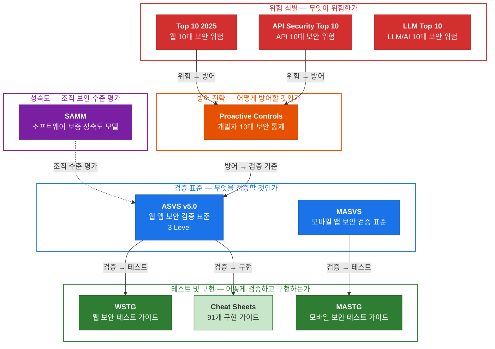

# OWASP 보안 프로젝트 체계

## 개요

OWASP(Open Worldwide Application Security Project)는 소프트웨어 보안 향상을 목표로 하는 비영리 재단입니다. 보안 위험 목록, 검증 표준, 테스트 가이드, 오픈소스 도구 등을 커뮤니티 기반으로 개발·공개합니다.

| 항목 | 내용 |
|------|------|
| **설립** | 2001년 |
| **성격** | 비영리 재단 (501(c)(3)) |
| **라이선스** | CC BY-SA 4.0 (모든 문서 프로젝트) |
| **프로젝트 수** | 418개+ |
| **GitHub** | https://github.com/OWASP |
| **공식 사이트** | https://owasp.org |
| **한국 챕터** | [OWASP Seoul Chapter](https://owasp.org/www-chapter-seoul/) (5기 운영 중, 월간 세미나 활동) |

> OWASP의 모든 문서 프로젝트는 **CC BY-SA 4.0** 라이선스로 자유롭게 활용할 수 있습니다.

---

## 학습 경로

OWASP를 처음 접한다면 아래 순서로 읽는 것을 권장합니다.

```
Step 1              Step 2              Step 3              Step 4
위험 식별       →    검증 표준      →    테스트 방법    →    구현 가이드
                                      
📄 Top 10 2025      📄 ASVS v5.0        📄 WSTG v4.2        📄 Cheat Sheets
(10대 웹 보안       (검증 요구사항,      (테스트 방법론,       (91개 구현
 위험 목록)          3 Level)            카테고리별 기법)      가이드)
```

| Step | 읽을 문서 | 이 단계에서 알게 되는 것 |
|------|----------|----------------------|
| **1. 위험 식별** | [Top 10 2025](./Top10-2025/README.md) | 웹 애플리케이션에서 가장 심각한 10대 보안 위험이 무엇인지 |
| **2. 검증 표준** | [ASVS v5.0](./ASVS/README.md) | 애플리케이션이 보안 요구사항을 충족하는지 검증하는 기준 |
| **3. 테스트 방법** | [WSTG v4.2](./WSTG/README.md) | ASVS 요구사항을 실제로 어떻게 테스트하는지 |
| **4. 구현 가이드** | [Cheat Sheet Series](https://cheatsheetseries.owasp.org) | 특정 보안 통제를 코드로 어떻게 구현하는지 (91개 가이드) |

> **Step 1~2까지 읽으면** OWASP 체계의 핵심을 이해한 것입니다. Step 3~4는 실무 적용 시 참고하세요.

추가로:
- [OWASP 주요 프로젝트 목록](./projects.md) — Flagship/Production/Lab/Incubator 프로젝트
- [Top 10 프로젝트 전체 목록](./top10-catalog.md) — 26개 도메인별 Top 10 모음

---

## 프로젝트 분류 체계

OWASP 프로젝트는 **성숙도**에 따라 분류됩니다:

| 분류 | 설명 | 프로젝트 수 |
|------|------|-----------|
| **Flagship** | OWASP의 전략적 가치를 입증한 핵심 프로젝트. 글로벌 보드 승인 필요 | 15개 |
| **Production** | 프로덕션 준비 완료. 정기적 릴리스와 활발한 유지보수 | 11개 |
| **Lab** | OWASP 검토 완료. 가치 입증 단계 | 33개 |
| **Incubator** | 실험/개발 단계의 신규 프로젝트 | 200개+ |

---

## 핵심 프로젝트 간 관계



---

## NIST와의 비교

| 구분 | NIST | OWASP |
|------|------|-------|
| **성격** | 미국 연방기관 (정부 표준) | 비영리 커뮤니티 (자발적 가이드) |
| **대상** | 조직의 정보시스템 전반 | 애플리케이션 보안 (웹/모바일/API) |
| **강제성** | 연방기관은 의무 준수 | 자발적 채택 (업계 사실상 표준) |
| **구조** | 위계적 (CSF → RMF → 800-53) | 독립적 프로젝트 모음 |
| **대응 관계** | CSF = 목표, 800-53 = 컨트롤, 800-53A = 평가 | Top 10 = 위험, ASVS = 검증, WSTG = 테스트 |
| **라이선스** | 퍼블릭 도메인 | CC BY-SA 4.0 |

---

## Flagship 프로젝트 한눈에 보기

### 문서/표준 (7개)

| 프로젝트 | 설명 | 최신 버전 |
|---------|------|----------|
| **Top 10** | 웹 애플리케이션 10대 보안 위험 | 2025 |
| **ASVS** | 애플리케이션 보안 검증 표준 | v5.0.0 (2025.5) |
| **WSTG** | 웹 보안 테스트 가이드 | v4.2 |
| **MAS** (MASVS/MASTG) | 모바일 앱 보안 표준 및 테스트 가이드 | 지속 업데이트 |
| **SAMM** | 소프트웨어 보증 성숙도 모델 | 지속 업데이트 |
| **Cheat Sheet Series** | 91개 보안 구현 가이드 | 지속 업데이트 |
| **CycloneDX** | BOM(Bill of Materials) 표준 (ECMA-424) | ECMA 표준 인증 |

### 도구/코드 (8개)

| 프로젝트 | 설명 |
|---------|------|
| **Juice Shop** | 의도적으로 취약한 웹 앱 (학습용) |
| **Dependency-Check** | SCA(소프트웨어 구성 분석) 도구 |
| **Dependency-Track** | 컴포넌트 분석 및 공급망 위험 관리 |
| **DefectDojo** | 애플리케이션 취약점 관리 플랫폼 |
| **ModSecurity CRS** | WAF(웹 방화벽) Core Rule Set |
| **Amass** | 네트워크 매핑 및 외부 자산 발견 |
| **OWTF** | 공격적 웹 테스트 프레임워크 |
| **Security Shepherd** | 웹/모바일 보안 교육 플랫폼 |

---

## 참고 링크

| 리소스 | URL |
|--------|-----|
| OWASP 공식 사이트 | https://owasp.org |
| 프로젝트 목록 | https://owasp.org/projects/ |
| GitHub | https://github.com/OWASP |
| Cheat Sheet Series | https://cheatsheetseries.owasp.org |
| OWASP Seoul Chapter | https://owasp.org/www-chapter-seoul/ |
| OWASP Slack | https://owasp.org/slack/invite |
